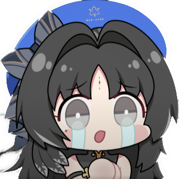

<div align="center">
  <h1 align="center">
    
    <br/>
    wuwa-auto
  </h1>

  <p>
    An image-recognition-based automation tool for <b>Wuthering Waves</b>, with background mode support, built on the <a href="https://github.com/ok-oldking/ok-script">ok-script</a> framework.
  </p>

  <p><i>Operates by simulating the Windows user interface — no memory reading, no file modification.</i></p>
</div>

<!-- Badges -->
<div align="center">


[](https://github.com/suho-1/wuwa-auto/releases)
[](LICENSE)

</div>

---

## ⚠️ Disclaimer

This software is an external auxiliary tool designed to automate parts of the Wuthering Waves gameplay. It interacts with the game solely by simulating standard user interface actions, in compliance with relevant laws and regulations. This project aims to simplify repetitive user tasks and does not disrupt game balance or provide an unfair advantage. It will never modify any game files or data.

This software is open-source and free, intended for personal learning and communication purposes only. Do not use it for any commercial or profit-making activities.

Please note, according to Kuro Games' official Fair Play Declaration for Wuthering Waves:
> The use of any third-party tools to disrupt the game experience is strictly prohibited.
> We will take strict measures against the use of unauthorized tools such as cheats, speed hacks, cheat software, and macro scripts. This includes, but is not limited to, automated farming, skill acceleration, god mode, teleportation, and modification of game data.
> Once verified, we will impose penalties based on the severity and frequency of the violation, including but not limited to deducting illicit gains, and suspending or permanently banning the game account.

**By using this software, you acknowledge that you have read, understood, and agreed to the above statement, and you voluntarily assume all potential risks.**

## ✨ Features

*   **High-Resolution Support** — Runs smoothly on all 16:9 resolutions up to 4K (minimum 1280×720). Some features are also compatible with 21:9 ultrawide.
*   **Background Mode** — Supports running while the game window is minimized or obscured, so you can use your computer for other tasks.
*   **Intelligent Recognition** — Automatically identifies all characters with no manual skill-sequence configuration needed. One-click start.
*   **Auto-Mute** — Optionally mutes the game audio when running in the background.
*   **Auto Combat** — Intelligent rotational combat for all resonators with character-specific skill chains.
*   **Echo Farming** — Automated echo boss tracking with minimap navigation, locked-area skipping, and 360° camera scanning.
*   **Daily Routines** — One-click daily task runner: simulation, forgery, tacet fields, and waveplate management.
*   **Desktop Control Center** — A native Windows interface for capture setup, triggers, routines, live status, logs, and configuration.
*   **Chest Exploration** — Automated route playback for chest hunting across all regions.

## 🚀 Quick Start

1.  **Clone this repository**:
    ```bash
    git clone https://github.com/suho-1/wuwa-auto.git
    ```
2.  **Install dependencies** (Python 3.12 recommended):
    ```bash
    pip install -r requirements.txt --upgrade
    ```
3.  **Run the desktop app**:
    ```bash
    python main.py
    ```
    Or use the included launcher:
    ```bash
    wuwa-auto.bat
    ```

    The native **wuwa-auto** control center opens by default. The previous terminal dashboard remains available as an optional compatibility mode:
    ```bash
    python main.py --tui
    ```

### Safe Daily recovery sequence

Until a Windows/game build has passed end-to-end checks, use **Daily Task → Execution Mode** in this order:

1. **Read Only (Guidebook Check)** — reads Activity and the 180-Waveplate objective, then returns to the world without claiming or spending.
2. **One Simulation (40 Waveplates)** — performs one selected Simulation claim and reports the before/after regular and reserve Waveplates.
3. **Full Daily Routine** — enable only after the first two modes pass. **Always Burn Waveplates** is a separate opt-in and is disabled by default.

A verified one-Simulation run must show a 39–41 regular-Waveplate decrease (allowing one regenerated point) and no reserve-Waveplate change. The routine no longer reports completion unless final Activity OCR confirms 100/100.

## 🔧 Troubleshooting

If you encounter issues, first inspect the startup identity in `logs/wuwa-auto.log` or launcher output. A current recovery launch prints a line beginning with `WUWA-AUTO STARTUP`; it must show `ui_mode=qt-desktop` and `source_build=recovery-20261003.1`. If the line is absent—or runtime configuration still shows `gui: None` and `tui: True`—an older packaged build is running instead of this source.

Then check the following:

1.  **Antivirus Software** — Add the installation directory to your antivirus whitelist (including Windows Defender) to prevent files from being blocked.
2.  **Display Settings**:
    *   In-game filters are fine, but disable GPU-level filters (NVIDIA Dynamic Vibrance, AMD sharpening).
    *   Use the game's default brightness.
    *   Disable overlays (MSI Afterburner, Fraps, etc.).
3.  **Custom Keybinds** — If you changed the default in-game keybinds, update them in the wuwa-auto settings. Only listed keybinds are supported.
4.  **Software Version** — Make sure you're on the latest version.
5.  **Game Performance** — The game must run stably at **60 FPS**. Lower graphics if needed.
6.  **Game Disconnections** — Enable "Close Launcher After Start" in settings, or run from source.
7.  **OpenVINO Error** — If you get `0x000005` on an Intel CPU with NPU, update to the latest Intel NPU driver.
8.  **Disable Auto Sprint** — Turn off Auto Sprint in the game settings.
9.  **Equip a Main Echo** — Every character in the team must have a main Echo equipped (the Echo Skill icon should appear in the bottom-right corner). Without one, Auto Combat may lock onto enemies without attacking.

---

## 💻 Developer Guide

### Running from Source

Python 3.12 is recommended. Python 3.10+ is required but other versions have not been fully tested.

```bash
# Install or update dependencies
pip install -r requirements.txt --upgrade

# Run Release version
python main.py

# Run Debug version
python main_debug.py
```

### Command-Line Arguments

```bash
# Open the desktop UI and start the first task
python main.py -t 1

# Run the first task without a UI and exit when done
python main.py --headless -t 1 -e

# Use the legacy terminal dashboard
python main.py --tui
```

*   `-t` / `--task` — Automatically run a task by its 1-based index, task name, or class name.
*   `-e` / `--exit` — Exit the game and app after the selected task completes.
*   `-h` / `--headless` — Run without opening the desktop interface.
*   `--tui` — Open the legacy terminal dashboard instead of the desktop interface.

### Running Tests

```bash
python -m unittest discover tests
```

---

## 🏗️ Project Structure

```
├── src/
│   ├── char/           # Character-specific combat rotations
│   ├── combat/         # Combat check and team advisor
│   ├── task/           # Automation tasks (echo, daily, dungeon, etc.)
│   ├── tui/            # Optional legacy terminal dashboard
│   └── gui/            # wuwa-auto custom desktop tabs and annotation studio
├── ok/                 # Automation framework and native Qt desktop UI
├── assets/             # YOLO models, sprite atlases, templates
├── tests/              # Unit tests and benchmarks
├── training/           # Dataset pipeline and labeling tools
├── config.py           # Application configuration
├── main.py             # Entry point
└── requirements.txt    # Python dependencies
```

---

## ❤️ Credits & Acknowledgements

This project is a fork/derivative of [**ok-ww**](https://github.com/ok-oldking/ok-wuthering-waves) by [ok-oldking](https://github.com/ok-oldking). The original project and the [ok-script](https://github.com/ok-oldking/ok-script) framework it's built on made this work possible. Huge thanks to the original author and all contributors.

### Additional Thanks

*   [ok-oldking/ok-script](https://github.com/ok-oldking/ok-script) — The automation framework powering this project
*   [ok-oldking/ok-wuthering-waves](https://github.com/ok-oldking/ok-wuthering-waves) — The original ok-ww project
*   [lazydog28/mc_auto_boss](https://github.com/lazydog28/mc_auto_boss)
*   [ok-oldking/OnnxOCR](https://github.com/ok-oldking/OnnxOCR)
*   [zhiyiYo/PyQt-Fluent-Widgets](https://github.com/zhiyiYo/PyQt-Fluent-Widgets)
*   [Toufool/AutoSplit](https://github.com/Toufool/AutoSplit)

---

## 📄 License

This project is open-source. See [LICENSE](LICENSE) for details.
